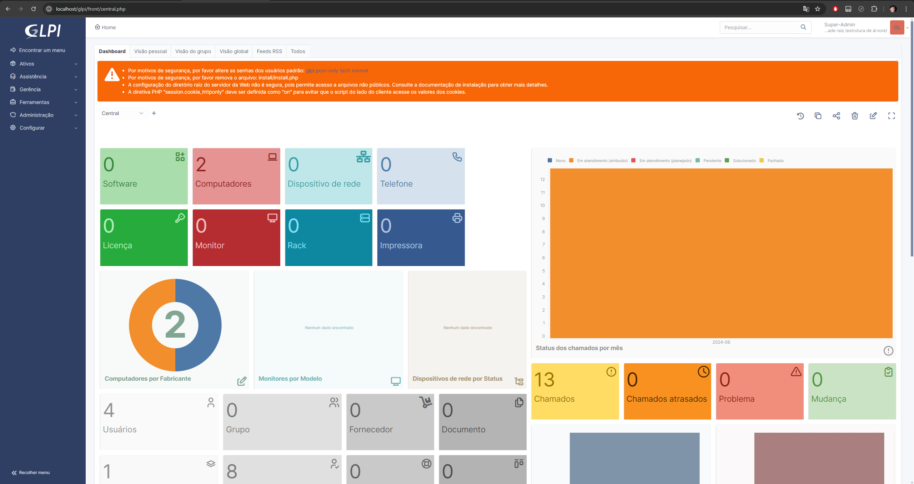
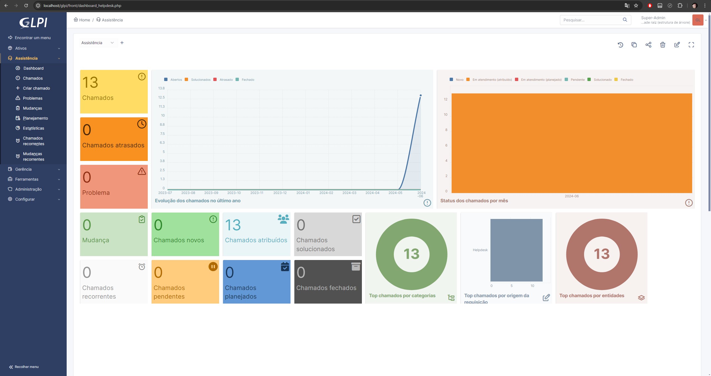
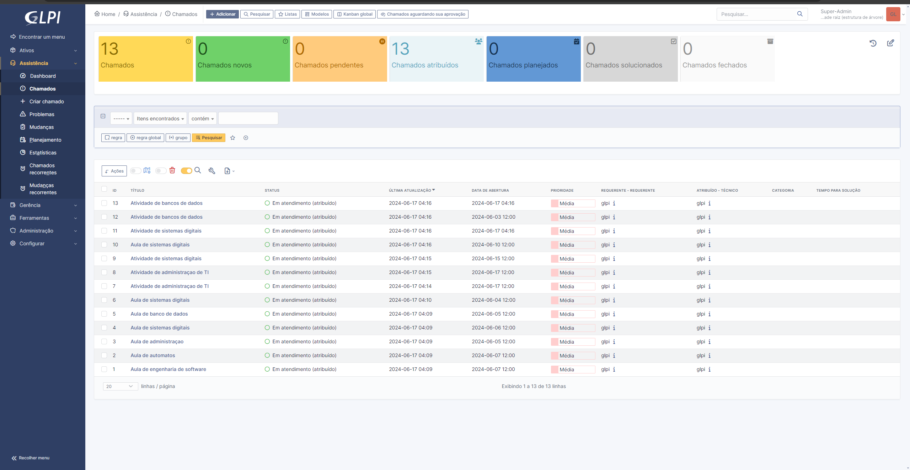
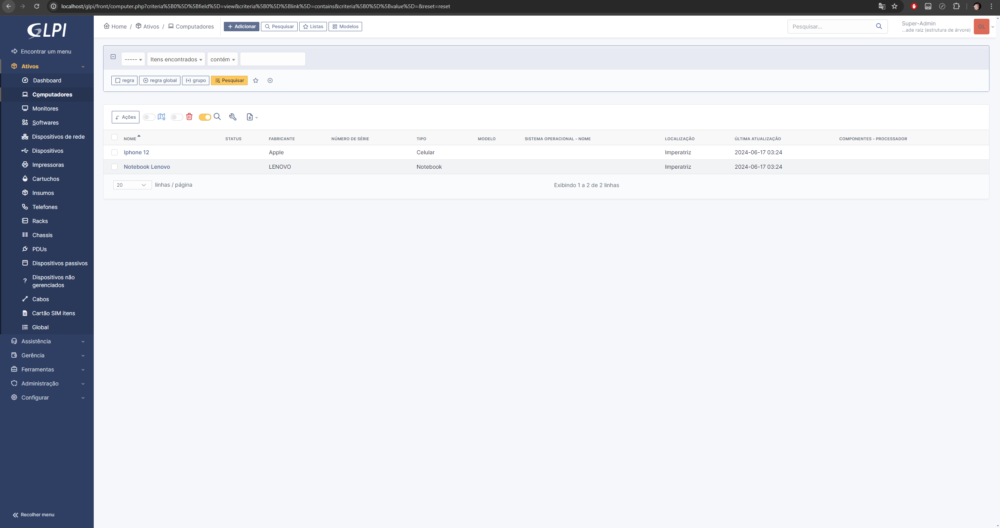

# Introdução ao GLPI

## Instalação do GLPI

O **GLPI** é um sistema de gerenciamento de TI que permite adicionar ativos, criar chamados, gerenciar usuários, entre outras funcionalidades. Vamos abordar o processo de instalação do GLPI, que pode ser realizado de três maneiras básicas:

### Métodos de instalação

- [XAMPP](https://www.apachefriends.org/pt_br/index.html): Uma distribuição Apache fácil de instalar, contendo PHP, MySQL e Perl.
- [WSL](https://learn.microsoft.com/pt-br/windows/wsl/): Subsistema Windows para Linux.
- [VirtualBox](https://www.virtualbox.org/): Uma máquina virtual que representa um computador físico.

## Meu processo de instalação e configuração

### Primeiro Passo

Optei pelo **XAMPP** para executar o GLPI. O **primeiro passo** é instalar o [XAMPP](https://www.apachefriends.org/pt_br/download.html). Ao acessar o site, há três opções de download. Utilizei a versão para Windows:

| Versão              | Soma de verificação | Tamanho |
| ------------------- | ------------------- | ------- |
| 8.0.30 / PHP 8.0.30 | md5 sha1            | 144mb   |

Com o XAMPP instalado, é necessário baixar a versão mais recente do [GLPI](https://glpi-project.org/pt-br/baixar/), que é a GLPI 10.0.15. Agora temos tudo o que precisamos para utilizar o GLPI. 😄

### Segundo Passo

Na **segunda parte**, extraia a pasta GLPI baixada e mova-a para a pasta do **XAMPP**. Dentro da pasta XAMPP, localize a pasta htdocs e coloque a pasta do GLPI lá. Agora o **XAMPP** pode usar as funcionalidades do GLPI.

### Terceiro Passo

**Nota:** Esta **terceira parte** é relevante se você já tiver o MySQL instalado, pois tanto o **MySQL** quanto o **XAMPP** utilizam a porta *3306*. Se você já estiver utilizando o MySQL, precisará fazer algumas configurações adicionais no XAMPP. Se não tiver esse problema, pule para o [**Quarto Passo**](#quarto-passo).

O erro pode ser:

```
09:25:43 [mysql] Problem detected!
09:25:43 [mysql] Port 3306 in use by "Unable to open process"!
09:25:43 [mysql] MySQL WILL NOT start without the configured ports free!
09:25:43 [mysql] You need to uninstall/disable/reconfigure the blocking application
09:25:43 [mysql] or reconfigure MySQL and the Control Panel to listen on a different port
```

Se você receber este erro, vá em **ACTIONS** e no **config** do módulo **Apache** e do módulo **MySQL** e altere a porta padrão de 3306 para 3307. No módulo do MySQL, edite o arquivo **my.ini**, encontre onde a porta 3306 está definida e altere para 3307, depois salve o arquivo. Use `Ctrl + F` para facilitar a busca. Repita o processo no arquivo **php.ini** do módulo Apache. Agora o seu banco de dados deve rodar na porta 3307.


### Quarto Passo

Com tudo pronto, inicie o **Apache** e o **MySQL** no XAMPP. Em seguida, abra o navegador e acesse `http://localhost/glpi`. Você será direcionado para a página principal do **GLPI**.

#### Primeiro Passo GLPI

Escolha o idioma padrão para o sistema GLPI. No meu caso, utilizei o português.

#### Segundo Passo GLPI

Aceite a nota de licença do **GLPI** e clique em **Continuar**.

#### Terceiro Passo GLPI

Escolha a opção **Instalar**.

#### Quarto Passo

Você verá algumas configurações faltando. As únicas necessárias são **gd** e **intl**. No **Module Apache**, abra o **config** do **php.ini** e descomente as linhas correspondentes a **gd** e **intl**, salvando o arquivo.


[Referência da imagem](https://www.youtube.com/watch?v=7-CqrK9pxz4&t=9s)

Atualize o navegador e continue.

#### Quinto Passo

Crie uma conexão com o banco de dados:

| Endereço do servidor | Usuário SQL | Senha |
| -------------------- | ----------- | ----- |
| localhost            | root        |       |

Clique em **Continuar**.

#### Sexto Passo

Crie um banco de dados. Nomeei o meu de *glpi*. Clique em **Continuar**.

#### Sétimo Passo

Permita a criação do banco de dados clicando em **Continuar**.

#### Oitavo Passo

Permita a coleta de dados clicando em **Continuar**.

#### Nono Passo

Clique em **Usar o GLPI** para finalizar a instalação.

#### Décimo Passo

Acesse o sistema com as credenciais:

| Nome do utilizador | Palavra passe |
| ------------------ | ------------- |
| glpi               | glpi          |

Agora você pode configurar o GLPI conforme necessário.

### Quinto Passo

Se chegou até aqui, você pode utilizar o sistema GLPI. Veja como ficou meu projeto:









Para mais informações, [clique aqui](https://www.youtube.com/watch?v=7-CqrK9pxz4&t=9s).
